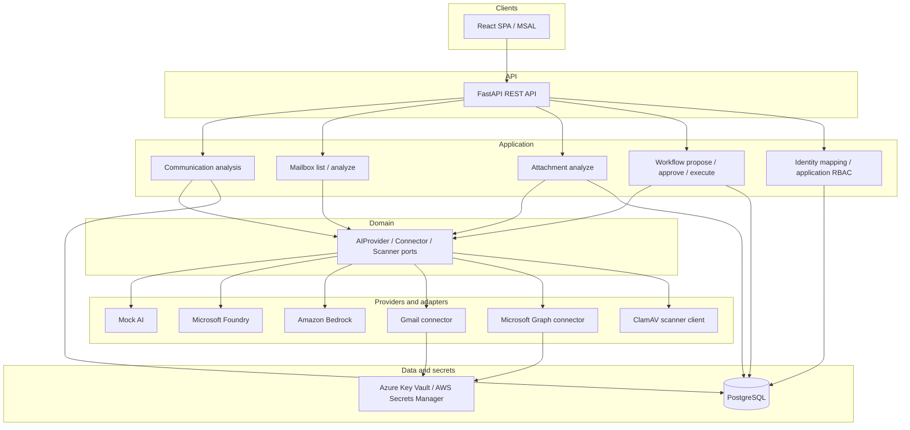

# Enterprise Communication Intelligence (ECI)

**ECI** is a production-oriented enterprise AI communication platform.

**Register. Connect. Analyze.**

It turns business communications into structured, actionable intelligence—summaries, priority, action items, draft replies, and (with explicit user action) secure attachment analysis—while keeping humans in control of every external side effect.

The same application image runs with a deterministic mock AI provider locally, **Microsoft Foundry** on Azure, and **Amazon Bedrock** on AWS. Mailbox integrations today cover **Gmail** and **Microsoft Graph / Outlook**. Application login uses **Microsoft Entra External ID** (OIDC / MSAL), separate from mailbox OAuth and from cloud workload identities.

This repository demonstrates enterprise application identity, connected mailbox workflows, AI-assisted analysis, secure attachment intelligence, controlled workflow execution, application RBAC, provider-independent AI architecture, and independent AWS and Azure deployments. It is not a claim of commercially production-ready SaaS certification or external business-user acceptance.

---

## Problem

Enterprise messages arrive across mailboxes with uneven priority, buried action items, and attachments that must not be fetched or analyzed without clear user intent. Typical automation either over-trusts AI or couples product logic to a single cloud or mailbox vendor.

ECI addresses that with:

- structured communication analysis behind a stable domain contract;
- explicit, permissioned human workflow (Propose → Approve → Execute/Send);
- fail-closed secure attachment intelligence (metadata-first; content only on explicit Analyze);
- application RBAC anchored to verified identity, not email;
- one codebase across independent Azure and AWS deployments (no cross-cloud database replication).

---

## Major capabilities

| Area | What exists today |
| --- | --- |
| Communication analysis | Summary, priority, category, action items, AI draft suggestion |
| Mailboxes | Gmail and Microsoft Graph/Outlook: connect, list, selected-message analyze |
| Secure attachments | Metadata listing; explicit single-attachment Analyze for PDF / DOCX / TXT; JPEG/PNG gated when image AI is unavailable; XLSX unsupported (fail-closed) |
| Workflow | Explicit Propose / Approve / Reject / Execute (Send)—never automatic from analyze or attachment analysis |
| Application auth | Microsoft Entra External ID + MSAL; five delegated `communications:*` scopes |
| Application RBAC | Persisted `application_role` (`user` \| `owner`); server-side `require_owner`; `/api/v1/me` and owner-only `/api/v1/admin/ping` |
| AI providers | `MockAIProvider`, `MicrosoftFoundryProvider`, `AmazonBedrockProvider` |
| Hosting | Azure Container Apps + Static Web Apps; AWS ECS Fargate + CloudFront/S3/ALB |
| Persistence | PostgreSQL (user-owned analyses, workflow actions, attachment analyses); separate DB per cloud |
| Credential stores | Azure Key Vault / AWS Secrets Manager (opaque `credential_ref`; no tokens in PostgreSQL) |
| Malware scanning | ClamAV client → external clamd (not embedded in the API image); production fails closed without a real scanner |

**Phase 18 invariant:** ECI never explicitly retrieves, decodes, persists, or analyzes attachment content without an explicit user action for that specific attachment. There is no automatic attachment download. Listing remains content-free. Raw attachment bytes are not durably persisted. ClamAV runs before parsing or AI. Unsupported or dangerous cases fail closed. Attachment analysis cannot trigger Propose, Approve, Execute, or Send.

---

## Architecture (high level)



Dependency direction stays:

**API → Application → Domain → Interfaces → Providers / Infrastructure**

Domain code does not depend on FastAPI, Azure SDK, AWS SDK, or HTTP clients. Cloud SDKs stay inside provider and infrastructure adapters.

AI provider pattern (application/domain boundary is cloud-neutral; infrastructure adapters are not interchangeable):

```text
ECI application / service layer
             ↓
       AI provider contract
          ↙        ↘
    Microsoft      Amazon
     Foundry        Bedrock
```

---

## Identity model

**ECI application login ≠ mailbox login.**

| Identity class | What it is | What it is not |
| --- | --- | --- |
| Application identity | Entra External ID OIDC → verified `(issuer, subject)` → `users.id` → persisted `application_role` | Does not grant mailbox access |
| Mailbox identity | Separate Gmail / Microsoft Graph delegated OAuth → credential store | Does not determine Platform Owner |
| Workload identity | Azure Managed Identity / AWS ECS Task Role | Not an end-user login |
| Database identity | PostgreSQL roles/credentials | Not application RBAC |
| Deploy identity | GitHub OIDC → Azure UAMI / AWS IAM deploy role | Not runtime product login |

Authorization for Platform Owner is:

```text
verified (issuer, subject)
        ↓
external identity mapping
        ↓
internal users.id
        ↓
persisted application_role
```

Email may appear in the UI for display, but it is **not** the authorization key. New or mapped users remain ordinary `user` unless explicitly promoted. Owner checks use server-side persistence—not a frontend badge or client-supplied role.

First-owner bootstrap uses the operator CLI with an **internal user UUID** (the target must already have an external identity mapping). A conflicting second-owner bootstrap is refused:

```bash
python -m app.cli.promote_owner --user-id <internal-user-uuid>
```

Do not put live internal user UUIDs or owner emails into documentation examples.

---

## Multi-cloud design

The same application, domain, and API are intentionally cloud-neutral. **Azure and AWS deployments are independent.** There is **no** cross-cloud database replication—each cloud has its own PostgreSQL and cloud resources.

### Azure

```text
Azure Static Web Apps
        ↓
Azure Container Apps
        ↓
Azure Database for PostgreSQL Flexible Server
        ↓
Microsoft Foundry (GPT-5.4-mini)
```

Supporting services include Azure Key Vault, managed identity, and Log Analytics. Region: **Spain Central**.

### AWS

```text
S3 + CloudFront (SPA)
        ↓
CloudFront API distribution
        ↓
Application Load Balancer
        ↓
ECS Fargate
        ↓
RDS PostgreSQL
        ↓
Amazon Bedrock (Claude Haiku 4.5)
```

Supporting services include AWS Secrets Manager, ECS Task Role, and CloudWatch. Region: **eu-south-2**.

Detailed comparison: [docs/cloud/comparison.md](docs/cloud/comparison.md).

Do not treat AI latency differences between Azure and AWS as a pure cloud-performance comparison—model and provider differences also matter. Neutral cloud presentation in the UI is not an official Microsoft or AWS endorsement.

---

## Platform Owner deployment indicator

Authenticated Platform Owners see an owner-visible deployment presentation indicator alongside the Platform Owner badge (for example **Platform Owner** with **Azure** or **AWS**). Expanded presentation may show safe labels such as:

| Cloud | AI | Region |
| --- | --- | --- |
| Azure | Microsoft Foundry | Spain Central |
| AWS | Amazon Bedrock | eu-south-2 |

This metadata is **presentation only**. It has no authorization significance, must not determine owner access, must not replace server-side RBAC, and must not expose infrastructure secrets or private identifiers.

---

## Frontend cloud builds

Manual cloud-specific Vite builds avoid accidental cross-environment configuration leakage:

```bash
# Azure
cd frontend
npm run build:azure
# equivalent: npm run build -- --mode azure

# AWS
npm run build:aws
# equivalent: npm run build -- --mode aws
```

Do **not** use a generic `npm run build` as the manual Azure or AWS deployment command.

Configuration model:

- **Azure:** tracked `frontend/.env.azure` contains **public presentation metadata only**. Operator/auth/API values remain local, environment, or CI supplied (for example `.env.azure.local`).
- **AWS:** tracked `frontend/.env.aws` contains **public presentation metadata only**. Operator/auth/API values remain local, environment, or CI supplied (for example `.env.aws.local`).

`.env.local` is shared across Vite modes; use `.env.azure.local` and `.env.aws.local` for mode-specific operator values.

Never place secrets, tokens, or client secrets in frontend env files. Presentation metadata has no authorization significance.

---

## Security and privacy design

- Fail-closed production auth (`APP_ENV=production` requires `AUTH_MODE=oidc`).
- Distinct permissions: `communications:read`, `analyze`, `connect`, `workflow`, `send`.
- Application RBAC (`user` / `owner`) is separate from mailbox OAuth and from `communications:*` scopes.
- Raw message bodies and raw attachment bytes are not durable product storage for analysis history.
- Attachment path: explicit user action → retrieve one → ClamAV → parse → AI; unsupported / dangerous cases fail closed.
- Privacy-safe operational logs (no tokens, secrets, or sensitive message/attachment bodies).
- Mailbox credentials outside PostgreSQL (Key Vault / Secrets Manager + advisory-lock coordination).

---

## Technical cloud validation status

Technical deployments have been validated on both clouds. This is **technical deployment validation**, not Phase 17D external business-user acceptance.

| Cloud | Validated (technical) |
| --- | --- |
| **AWS** | Frontend and backend operational; persistence during validation; application identity; first Platform Owner activation; `/api/v1/me`; owner-only `/api/v1/admin/ping`; owner deployment indicator shows AWS |
| **Azure** | Frontend operational; `/health` and `/api/v1/readiness`; PostgreSQL persistence during runtime check; application sign-in; `/api/v1/me`-backed owner state in UI; owner deployment indicator shows Azure; existing connected-mailbox state loads |

Phase 18 also live-validated secure attachment intelligence on crossed paths (Outlook → Azure / Foundry; Gmail → AWS / Bedrock) without Send. Image analysis is not live-supported today (adapters report image input unavailable; JPEG/PNG gated before retrieval).

Development and demo cloud resources may be intentionally stopped when not in use to control cost. Meaningful live testing requires an active serving revision (Azure Container App) or running ECS service, and an available PostgreSQL instance on that cloud.

---

## Testing and quality evidence

The repository includes automated backend and frontend test coverage (offline, deterministic). GitHub Actions CI runs pip check, ruff, pytest, ephemeral PostgreSQL integration, and frontend jobs.

Phase closures record live validation separately from offline regression. Live proofs use owner-controlled paths and stop before Send unless a phase explicitly records otherwise (Phase 16E historically included one manual Gmail Send; Phase 18 did not Send).

---

## Current project status

### Completed through Phase 19

Phases **1–16** are completed (foundation through cloud-hosted browser and multi-cloud mailbox→AI validation).

**Phase 17 — Microsoft Entra External ID**

- **17A–17C:** CLOSED / PASS (External ID product login, controlled validation, Gmail ID-token clock-skew hardening).
- **17D** external business-user verification: **DEFERRED / OUT OF CURRENT RELEASE SCOPE**.

**Phase 18 — Secure Attachment Intelligence:** **CLOSED / PASS**.

**Phase 19 — Platform Owner Identity & Application RBAC:** **CLOSED / PASS** (schema `19b0001`, server-side owner authorization, bootstrap CLI, `/me`, owner-aware UI). Follow-up technical deployment validation exercised first Platform Owner activation and the owner deployment indicator on AWS and Azure.

External business-user verification remains deferred and outside the currently completed release scope.

### Realistic remaining work

- Phase 17D external business-user verification (deferred).
- Optional: authorized live EICAR-vs-ClamAV; multimodal enablement only after a proven image-capable adapter.
- Mailbox sync, search, bulk analysis, workers, webhooks.
- Automatic replies, retry/reconciliation, exactly-once delivery.
- Full 2×2×2 cloud × mailbox × AI matrix (validated crossed paths only).
- Distributed tracing, custom metrics/dashboards/alerts, DB backup/PITR/HA/DR hardening.

Stopped managed databases may automatically restart after the provider stop interval (AWS currently 7 days). Privileged RDS / Azure PostgreSQL start-stop remains an operator action.

---

## Repository structure

```text
app/                 FastAPI API, application, domain, infrastructure, providers
frontend/            React + TypeScript + Vite SPA (MSAL)
tests/               Unit, integration, provider, PostgreSQL suites
deployment/
  azure/             ACA / SWA / Key Vault operator runbook
  aws/               ECS / CloudFront / RDS / Secrets Manager runbook
  docker/            Shared image build context
docs/
  architecture/      Layering and design
  decisions/         ADRs
  cloud/             Foundry, Bedrock, auth, deployment, observability
  api/               REST API reference
  diagrams/          Mermaid sources
  roadmap/           Phase history and closures
```

---

## Local development (quick start)

**Backend**

```bash
python -m venv .venv
source .venv/bin/activate
python -m pip install -e ".[dev]"
cp .env.example .env   # set AI_PROVIDER=mock for offline work
uvicorn app.main:app --reload
```

**Frontend** (`frontend/`)

```bash
cp .env.example .env   # public External ID / MSAL SPA values only
npm install
npm run dev            # http://localhost:5173
```

Set `CORS_ALLOWED_ORIGINS=http://localhost:5173` on the API. Configure mailbox OAuth client ids/redirects per `.env.example` when exercising connectors. Prefer `CREDENTIAL_STORE_BACKEND=memory` only for local/dev; production rejects `memory`.

Application login alone does not authorize a mailbox—mailbox testing requires an explicit separate OAuth operation. Prefer an ordinary application `user` for external evaluation; do not share the Platform Owner account with reviewers. AI execution and attachment retrieval may incur provider cost; Send/workflow execution should remain separately controlled.

**Quality checks**

```bash
python -m pip check
python -m ruff check .
python -m pytest
cd frontend && npm run typecheck && npm run lint && npm run test -- --run && npm run build
```

---

## Technology stack

- **Backend:** Python 3.12, FastAPI, Pydantic v2, SQLAlchemy 2.x, Alembic, PostgreSQL
- **Frontend:** React 19, TypeScript, Vite, MSAL, TanStack Query, Tailwind CSS
- **AI:** Provider abstraction; Mock; Microsoft Foundry (Responses API); Amazon Bedrock (Converse)
- **Cloud:** Azure Container Apps, ACR, Key Vault, Static Web Apps, Log Analytics; AWS ECS Fargate, ECR, Secrets Manager, CloudWatch, CloudFront, S3, ALB, RDS
- **CI/CD:** GitHub Actions + GitHub OIDC (no long-lived deploy secrets in the app image)

---

## Documentation map

| Topic | Link |
| --- | --- |
| Roadmap index | [docs/roadmap/README.md](docs/roadmap/README.md) |
| Phase 19 (RBAC / owner) | [docs/roadmap/phase-19-platform-owner-identity-and-application-rbac.md](docs/roadmap/phase-19-platform-owner-identity-and-application-rbac.md) |
| Phase 18 (attachments) | [docs/roadmap/phase-18-secure-attachment-intelligence.md](docs/roadmap/phase-18-secure-attachment-intelligence.md) |
| Phase 17 (External ID) | [docs/roadmap/phase-17-external-id-external-user-onboarding.md](docs/roadmap/phase-17-external-id-external-user-onboarding.md) |
| Architecture | [docs/architecture/README.md](docs/architecture/README.md) |
| ADRs | [docs/decisions/README.md](docs/decisions/README.md) |
| Cloud / AI providers | [docs/cloud/README.md](docs/cloud/README.md) |
| Cloud comparison | [docs/cloud/comparison.md](docs/cloud/comparison.md) |
| Authentication | [docs/cloud/authentication.md](docs/cloud/authentication.md) |
| API | [docs/api/README.md](docs/api/README.md) |
| Diagrams | [docs/diagrams/README.md](docs/diagrams/README.md) |
| Azure runbook | [deployment/azure/README.md](deployment/azure/README.md) |
| AWS runbook | [deployment/aws/README.md](deployment/aws/README.md) |
| Frontend | [frontend/README.md](frontend/README.md) |

---

## Development roadmap (summary)

| Phase | Status |
| --- | --- |
| Phases 1–16 | Completed |
| Phase 17 – External ID & external user onboarding | 17A–17C CLOSED / PASS; **17D deferred** |
| Phase 18 – Secure Attachment Intelligence | **CLOSED / PASS** |
| Phase 19 – Platform Owner Identity & Application RBAC | **CLOSED / PASS** |

Full phase table and narratives: [docs/roadmap/README.md](docs/roadmap/README.md).

---

## License

MIT License
