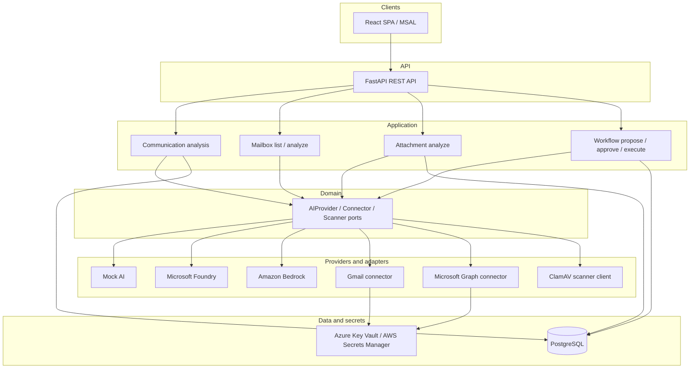

# Enterprise Communication Intelligence Platform

**ECI Platform** is a production-oriented enterprise AI system that turns business communications into structured, actionable intelligence—summaries, priority, action items, draft replies, and (with explicit user action) secure attachment analysis—while keeping humans in control of every external side effect.

It is engineered as a **provider-independent** platform: the same application image runs with a deterministic mock AI provider locally, **Microsoft Foundry** on Azure, and **Amazon Bedrock** on AWS. Mailbox integrations today cover **Gmail** and **Microsoft Graph / Outlook**. Application login uses **Microsoft Entra External ID** (OIDC / MSAL), separate from mailbox OAuth and from cloud workload identities.

This repository is a practical demonstration of AI solution architecture, clean engineering, and multi-cloud validation—not a claim of production SaaS certification or external-user validation.

---

## Problem

Enterprise messages arrive across mailboxes with uneven priority, buried action items, and attachments that must not be fetched or analyzed without clear user intent. Typical automation either over-trusts AI or couples product logic to a single cloud or mailbox vendor.

ECI addresses that with:

- structured communication analysis behind a stable domain contract;
- explicit, permissioned human workflow (Propose → Approve → Execute/Send);
- fail-closed secure attachment intelligence (metadata-first; content only on explicit Analyze);
- one codebase across Azure and AWS AI/hosting stacks.

---

## Major capabilities

| Area | What exists today |
| --- | --- |
| Communication analysis | Summary, priority, category, action items, AI draft suggestion |
| Mailboxes | Gmail and Microsoft Graph/Outlook: connect, list, selected-message analyze |
| Secure attachments | Metadata listing; explicit single-attachment Analyze for PDF / DOCX / TXT; JPEG/PNG gated when image AI is unavailable; XLSX unsupported (fail-closed) |
| Workflow | Explicit Propose / Approve / Reject / Execute (Send)—never automatic from analyze or attachment analysis |
| Application auth | Microsoft Entra External ID + MSAL; five delegated `communications:*` scopes |
| AI providers | `MockAIProvider`, `MicrosoftFoundryProvider`, `AmazonBedrockProvider` |
| Hosting | Azure Container Apps + Static Web Apps; AWS ECS Fargate + CloudFront/S3/ALB |
| Persistence | PostgreSQL (user-owned analyses, workflow actions, attachment analyses) |
| Credential stores | Azure Key Vault / AWS Secrets Manager (opaque `credential_ref`; no tokens in PostgreSQL) |
| Malware scanning | ClamAV client → external clamd (not embedded in the API image); production fails closed without a real scanner |

**Phase 18 invariant:** ECI never explicitly retrieves, decodes, persists, or analyzes attachment content without an explicit user action for that specific attachment. There is no automatic attachment download. Listing remains content-free. Raw attachment bytes are not durably persisted. ClamAV runs before parsing or AI. Unsupported or dangerous cases fail closed. Attachment analysis cannot trigger Propose, Approve, Execute, or Send.

---

## Architecture (high level)



Dependency direction stays:

**API → Application → Domain → Interfaces → Providers / Infrastructure**

Domain code does not depend on FastAPI, Azure SDK, AWS SDK, or HTTP clients. Cloud SDKs stay inside provider and infrastructure adapters.

Identity domains stay separate:

```text
ECI application login     Microsoft Entra External ID → OIDC JWT → users.id
Mailbox login             Gmail / Microsoft Graph delegated OAuth → credential store
Cloud workload identity   Azure Managed Identity / AWS ECS Task Role
Deploy identity           GitHub OIDC → Azure UAMI / AWS IAM deploy role
```

---

## Multi-cloud validation status

Phase 18 attachment intelligence was **live-validated across Azure and AWS using crossed provider paths**: Outlook with Azure / Microsoft Foundry, and Gmail with AWS / Amazon Bedrock, with the post-fix Outlook / Graph contract **regression-verified locally** (focused mocked suites; **86 tests passed**; no shared-contract regression; no code changes required for that verification).

This is engineered multi-cloud validation of owner-controlled paths—not production SaaS certification and **not** Phase 17D external business-user verification.

| Cloud | Live path validated in Phase 18 | Retained state after validation |
| --- | --- | --- |
| **Azure** | Outlook / Graph mailbox; explicit PDF / DOCX → ClamAV → Foundry; XLSX unsupported; JPEG/PNG gated before retrieval when image AI unavailable; **no Send** | ACA scaled to 0; Azure PostgreSQL stopped; SWA remains serverless |
| **AWS** | External ID application login; protected API auth; Gmail OAuth; metadata-only attachment listing; explicit PDF / DOCX → ClamAV → Bedrock → persistence; XLSX / PNG / JPEG pre-retrieval gates; **no** Propose / Approve / Execute / Send | Task definition `eci-api-dev:10`; ECS desired/running/pending `0/0/0`; RDS `eci-pg-dev` stopped |

Schema head includes Alembic `18d0001`. Closure commit for the AWS live-validation record: `99b4836`.

**Image analysis:** PNG / JPEG analysis did **not** succeed in Phase 18 live validation. Current AI adapters report image input unavailable; images were correctly gated **before** attachment retrieval. Multimodal image analysis may be a future capability only—not live-supported today.

**Gmail attachment identity (Phase 18 fix):** Gmail’s `body.attachmentId` can change across `messages.get` responses. ECI previously exposed that ephemeral value as `provider_attachment_id`, so Analyze re-list could miss the attachment. Gmail now exposes stable MIME `partId` as the opaque id; only on explicit Analyze does the Gmail connector resolve `partId` → current `attachmentId` and call `attachments.get`. Graph continues to use its stable Graph attachment id. Details: [Phase 18 roadmap](docs/roadmap/phase-18-secure-attachment-intelligence.md).

Do **not** read this as “Outlook was live-tested on AWS after the Gmail fix.”

---

## Security and privacy design

- Fail-closed production auth (`APP_ENV=production` requires `AUTH_MODE=oidc`).
- Distinct permissions: `communications:read`, `analyze`, `connect`, `workflow`, `send`.
- Raw message bodies and raw attachment bytes are not durable product storage for analysis history.
- Attachment path: explicit user action → retrieve one → ClamAV → parse → AI; unsupported / dangerous cases fail closed.
- Privacy-safe operational logs (no tokens, secrets, or sensitive message/attachment bodies).
- Mailbox credentials outside PostgreSQL (Key Vault / Secrets Manager + advisory-lock coordination).

---

## Testing and quality evidence

- Offline, deterministic backend tests (pytest) and frontend typecheck / lint / test / build.
- GitHub Actions CI: pip check, ruff, pytest, ephemeral PostgreSQL integration, frontend jobs.
- Phase closures record live validation separately from offline regression; live proofs use owner-controlled mailboxes and stop before Send unless a phase explicitly records otherwise (Phase 16E historically included one manual Gmail Send; Phase 18 did not Send).

---

## Current project status

### Completed through Phase 18

Phases **1–16** are completed (foundation through cloud-hosted browser and multi-cloud mailbox→AI validation).

**Phase 17 — Microsoft Entra External ID**

- **17A–17C:** CLOSED / PASS (External ID product login, controlled validation, Gmail ID-token clock-skew hardening).
- **17D** external business-user verification: **DEFERRED / OUT OF CURRENT RELEASE SCOPE**.

**Phase 18 — Secure Attachment Intelligence:** **CLOSED / PASS** (offline implementation, Azure Outlook→Foundry live attachment path, AWS External ID + Gmail→Bedrock live attachment path).

### Realistic remaining work

- Phase 17D external business-user verification (deferred).
- Optional: authorized live EICAR-vs-ClamAV; multimodal enablement only after a proven image-capable adapter.
- Mailbox sync, search, bulk analysis, workers, webhooks.
- Automatic replies, retry/reconciliation, exactly-once delivery.
- Full 2×2×2 cloud × mailbox × AI matrix (validated crossed paths only).
- Distributed tracing, custom metrics/dashboards/alerts, DB backup/PITR/HA/DR hardening.
- Standing cloud cost for retained ALB / ECR / CloudFront / S3 / logging where applicable.

Stopped managed databases may automatically restart after the provider stop interval (AWS currently 7 days). Privileged RDS / Azure PostgreSQL start-stop remains an operator action.

---

## Repository structure

```text
app/                 FastAPI API, application, domain, infrastructure, providers
frontend/            React + TypeScript + Vite SPA (MSAL)
tests/               Unit, integration, provider, PostgreSQL suites
deployment/
  azure/             ACA / SWA / Key Vault operator runbook
  aws/               ECS / CloudFront / RDS / Secrets Manager runbook
  docker/            Shared image build context
docs/
  architecture/      Layering and design
  decisions/         ADRs
  cloud/             Foundry, Bedrock, auth, deployment, observability
  api/               REST API reference
  diagrams/          Mermaid sources
  roadmap/           Phase history and closures
```

---

## Local development (quick start)

**Backend**

```bash
python -m venv .venv
source .venv/bin/activate
python -m pip install -e ".[dev]"
cp .env.example .env   # set AI_PROVIDER=mock for offline work
uvicorn app.main:app --reload
```

**Frontend** (`frontend/`)

```bash
cp .env.example .env   # public External ID / MSAL SPA values only
npm install
npm run dev            # http://localhost:5173
```

Set `CORS_ALLOWED_ORIGINS=http://localhost:5173` on the API. Configure mailbox OAuth client ids/redirects per `.env.example` when exercising connectors. Prefer `CREDENTIAL_STORE_BACKEND=memory` only for local/dev; production rejects `memory`.

**Quality checks**

```bash
python -m pip check
python -m ruff check .
python -m pytest
cd frontend && npm run typecheck && npm run lint && npm run test -- --run && npm run build
```

---

## Technology stack

- **Backend:** Python 3.12, FastAPI, Pydantic v2, SQLAlchemy 2.x, Alembic, PostgreSQL
- **Frontend:** React 19, TypeScript, Vite, MSAL, TanStack Query, Tailwind CSS
- **AI:** Provider abstraction; Mock; Microsoft Foundry (Responses API); Amazon Bedrock (Converse)
- **Cloud:** Azure Container Apps, ACR, Key Vault, Static Web Apps, Log Analytics; AWS ECS Fargate, ECR, Secrets Manager, CloudWatch, CloudFront, S3, ALB, RDS
- **CI/CD:** GitHub Actions + GitHub OIDC (no long-lived deploy secrets in the app image)

---

## Documentation map

| Topic | Link |
| --- | --- |
| Roadmap index | [docs/roadmap/README.md](docs/roadmap/README.md) |
| Phase 18 (attachments) | [docs/roadmap/phase-18-secure-attachment-intelligence.md](docs/roadmap/phase-18-secure-attachment-intelligence.md) |
| Phase 17 (External ID) | [docs/roadmap/phase-17-external-id-external-user-onboarding.md](docs/roadmap/phase-17-external-id-external-user-onboarding.md) |
| Architecture | [docs/architecture/README.md](docs/architecture/README.md) |
| ADRs | [docs/decisions/README.md](docs/decisions/README.md) |
| Cloud / AI providers | [docs/cloud/README.md](docs/cloud/README.md) |
| Authentication | [docs/cloud/authentication.md](docs/cloud/authentication.md) |
| API | [docs/api/README.md](docs/api/README.md) |
| Diagrams | [docs/diagrams/README.md](docs/diagrams/README.md) |
| Azure runbook | [deployment/azure/README.md](deployment/azure/README.md) |
| AWS runbook | [deployment/aws/README.md](deployment/aws/README.md) |
| Frontend | [frontend/README.md](frontend/README.md) |

---

## Development roadmap (summary)

| Phase | Status |
| --- | --- |
| Phases 1–16 | Completed |
| Phase 17 – External ID & external user onboarding | 17A–17C CLOSED / PASS; **17D deferred** |
| Phase 18 – Secure Attachment Intelligence | **CLOSED / PASS** |

Full phase table and narratives: [docs/roadmap/README.md](docs/roadmap/README.md).

---

## License

MIT License
