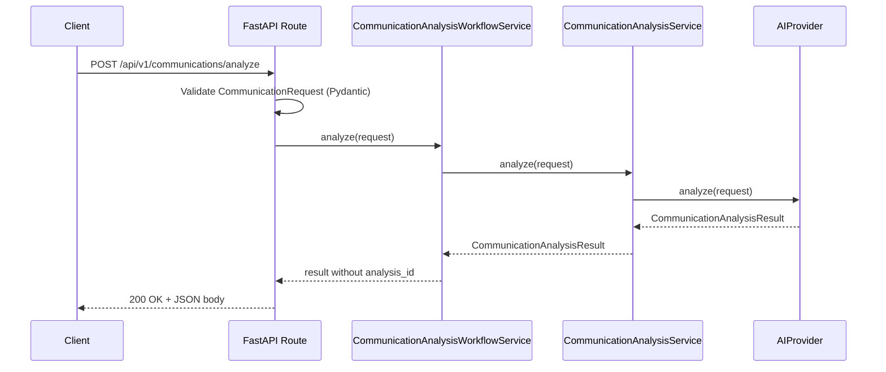
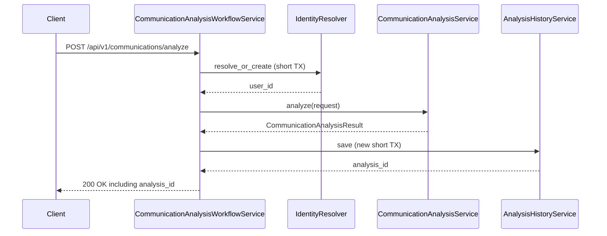
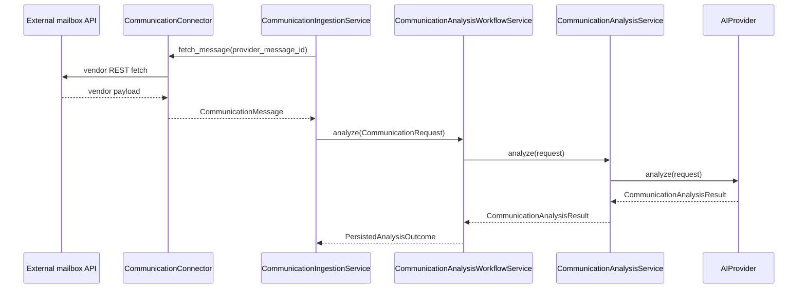
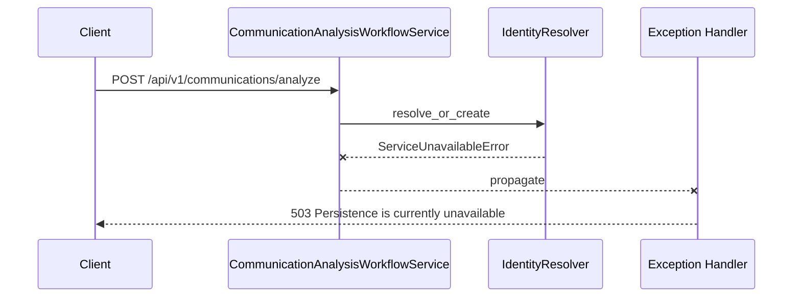
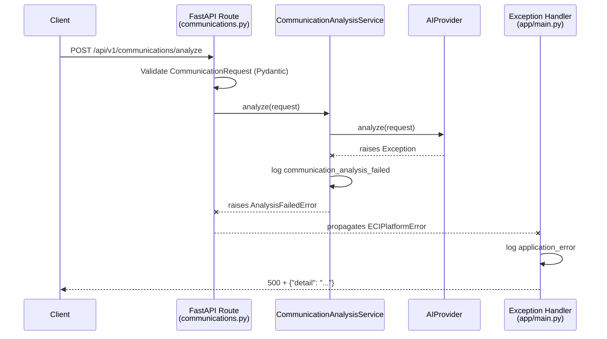
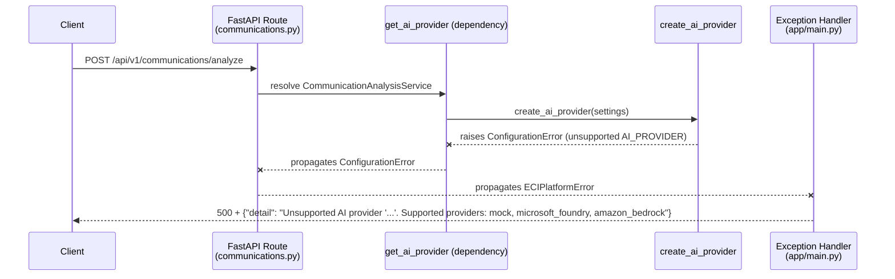
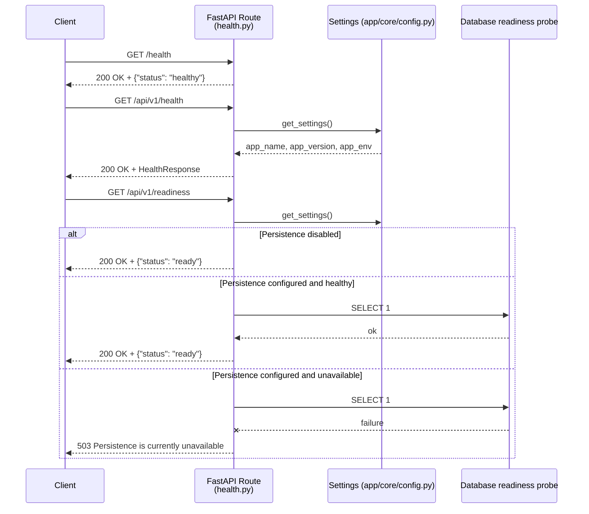
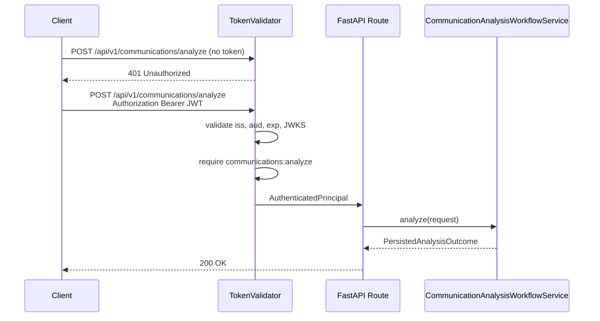
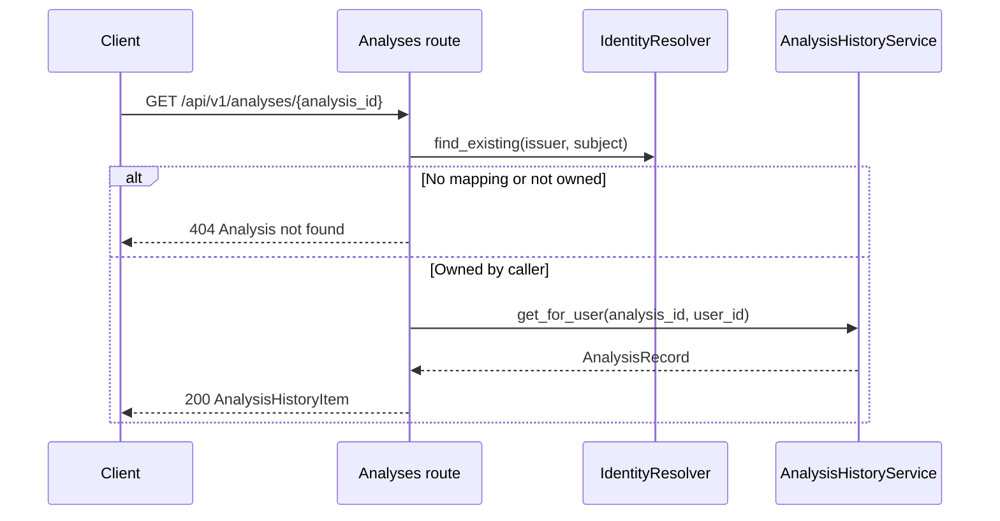

# Sequence Diagrams

These diagrams describe the request flows implemented as of Phase 10. Source `.mmd` files live in [`docs/diagrams/`](../diagrams/README.md); the communication-analysis HTTP flows are combined in [`request-flow.mmd`](../diagrams/request-flow.mmd). Persistence mapping is in [`persistence.mmd`](../diagrams/persistence.mmd). The sequence below uses `MockAIProvider` as the default local provider; `MicrosoftFoundryProvider` and `AmazonBedrockProvider` occupy the same `AIProvider` slot when selected. Connector adapters occupy the `CommunicationConnector` slot; vendor types do not appear above infrastructure.

## Successful Communication-Analysis Request (analyze-only)

When `DATABASE_URL` is omitted, or the caller is not an authenticated principal with persistence wired, analyze returns the AI result without `analysis_id`.



## Persist-after-analyze (authenticated, persistence configured)

Identity uses a short transaction that commits before the AI call. Analysis save uses a new short transaction after inference.



If save fails after a successful AI call, the workflow still returns HTTP 200 with the analysis and omits `analysis_id`. The provider is not retried.

## Connector ingestion → analysis (not an HTTP endpoint)

Phase 10 added no connector HTTP routes. This path exists below the product API. `CommunicationIngestionService` fetches one already-normalized message and reuses the existing workflow. Mailbox HTTP happens first, before workflow identity or history transactions. No database transaction is held open across the mailbox request or AI inference. When the workflow is constructed with an authenticated principal and persistence, it may persist a derived analysis (not raw mail) using the same short-transaction rules as HTTP analyze. Raw mailbox payloads are not persisted.



Vendor adapters (fake, Gmail REST, Microsoft Graph REST) implement `CommunicationConnector`. Application code never sees Gmail JSON, MIME, or Graph JSON.

This application path is covered by mocked ingestion-boundary tests. It is **not** a product-facing live-mailbox summary API.

### Controlled live adapter checks (not the application workflow)

Controlled local Gmail and Microsoft Graph verifications stopped at the connector/domain boundary:

```text
Gmail API / Microsoft Graph REST
        ↓
vendor CommunicationConnector adapter
        ↓
CommunicationMessage
        STOP
```

Those live checks did not call `CommunicationIngestionService`, `CommunicationAnalysisWorkflowService`, `AIProvider` (including Foundry, Bedrock, and `MockAIProvider`), PostgreSQL, or `connector_accounts`. They are not OAuth, send, reply, background-sync, or credential-resolver sequences.

The following are **not implemented** and are not shown as current flows: OAuth callback, credential resolver, background sync, automatic replies, sending.

## Identity failure before AI



No AI provider call is made.

## Provider Failure Flow



## Configuration Error Flow (Unsupported Provider)



## Health and Readiness

`GET /health` is process liveness only. `GET /api/v1/readiness` probes the database with `SELECT 1` only when `DATABASE_URL` is configured.



Health never queries PostgreSQL. Readiness does not leak database details.

## Authenticated Analyze Request (`AUTH_MODE=oidc`)

When `AUTH_MODE=oidc`, analyze requires a bearer token. Missing or invalid tokens return `401`. A valid token with permission `communications:analyze` continues to the workflow.



## Owned history request

Unknown and cross-user analysis ids both return `404`. History always requires an authenticated principal (`AUTH_MODE=disabled` returns `401`). Missing `DATABASE_URL` returns `503`.



## Workflow action lifecycle (Phase 11B, no HTTP)

Phase 11B persists user-owned workflow actions. There are still no workflow routes. The domain state machine is:

```text
PENDING → APPROVED → EXECUTING → EXECUTED
PENDING → REJECTED
EXECUTING → FAILED
```

```mermaid
sequenceDiagram
    participant Analysis as CommunicationAnalysis
    participant Draft as DraftReply
    participant Action as WorkflowAction

    Note over Analysis,Draft: Analyze produces suggestions only
    Analysis->>Draft: draft_reply body
    Note over Action: Explicit later construction; not created by analyze
    Action->>Action: PENDING (proposed_reply_body snapshotted)
    alt Human approves
        Action->>Action: APPROVED (approved_reply_body = proposed_reply_body)
        Action->>Action: EXECUTING
        alt Later execution success
            Action->>Action: EXECUTED
        else Later execution failure
            Action->>Action: FAILED
        end
    else Human rejects
        Action->>Action: REJECTED
    end
```

Authorization is capability-specific after JWT authentication:

```text
authenticate JWT → AuthenticatedPrincipal → required permission
communications:analyze     (existing analyze / history)
communications:workflow    (future workflow HTTP; checkable in 11A)
```
