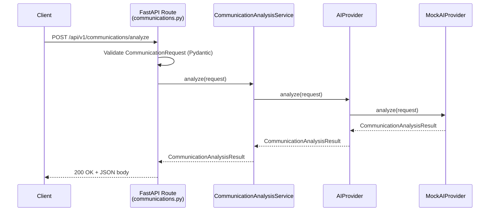
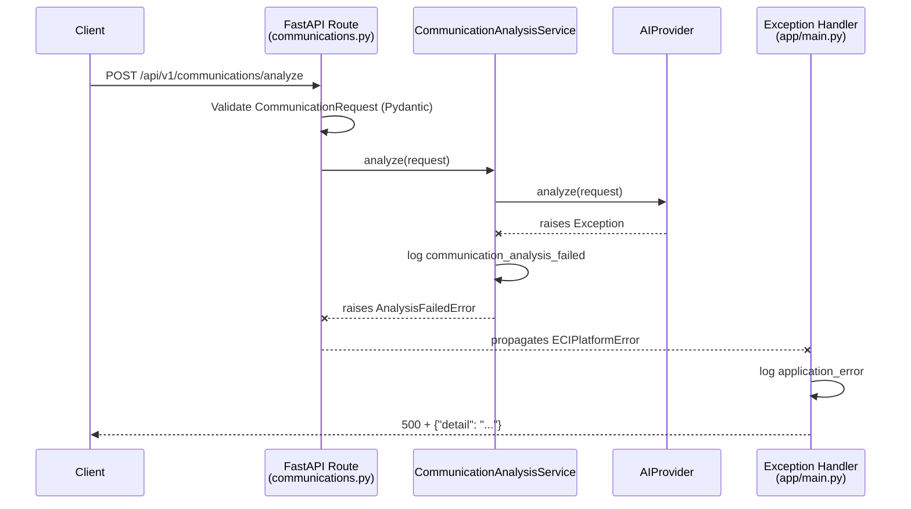
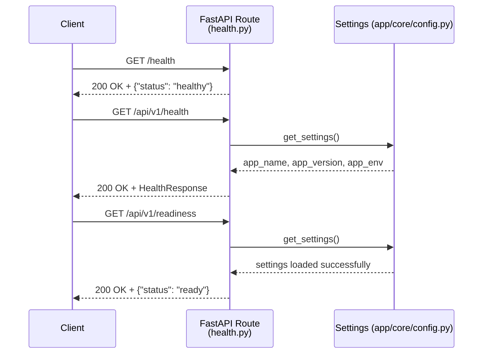

# Sequence Diagrams

These diagrams describe the request flows implemented as of Phase 6A. Source `.mmd` files live in [`docs/diagrams/`](../diagrams/README.md); the successful and failure communication-analysis flows are combined in [`request-flow.mmd`](../diagrams/request-flow.mmd). The sequence below uses `MockAIProvider` as the default local provider; `MicrosoftFoundryProvider` occupies the same `AIProvider` slot when selected. This page also documents the health request flow, which has no dedicated `.mmd` file since it involves no failure branching worth diagramming separately.

## Successful Communication-Analysis Request

## Provider Failure Flow

## Configuration Error Flow (Unsupported Provider)

## Health Request Flow

Health and readiness routes never call `CommunicationAnalysisService` or any `AIProvider` — they only read configuration.
