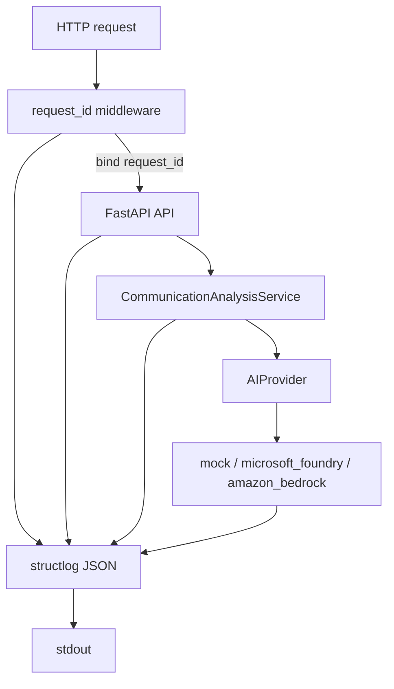
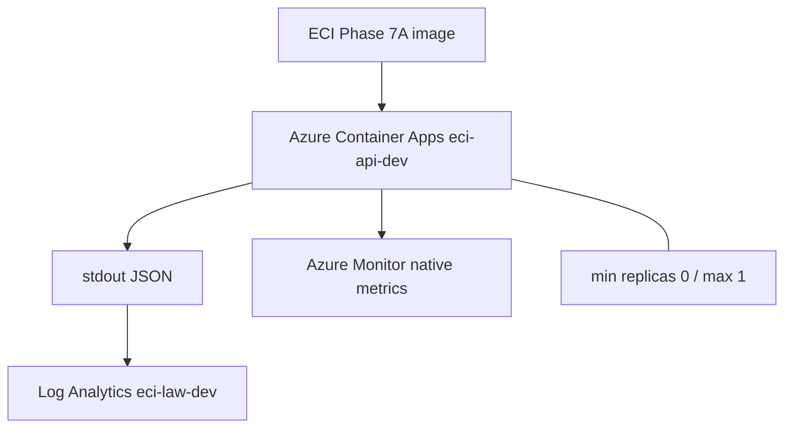
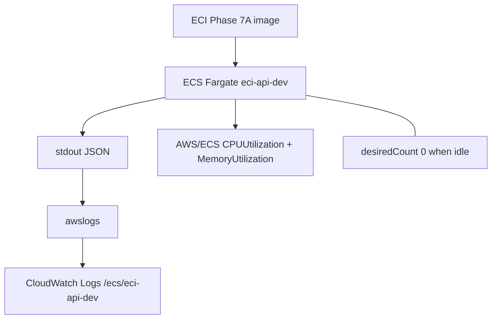

# Observability

Phase 7 adds portable application telemetry and native cloud log/metric retention. It is not a full SRE, SLO, or tracing platform.

Verified in Phases 7A–7C. Application schemas, health/readiness semantics, and provider authentication are unchanged.

## Application telemetry (Phase 7A)

Production logging is structured JSON on stdout via structlog. The application does not use Azure or AWS telemetry SDKs.

```text
Incoming HTTP request
→ request_id middleware
→ API
→ CommunicationAnalysisService
→ AIProvider
→ mock | microsoft_foundry | amazon_bedrock
→ structured telemetry
→ stdout
```

The application remains cloud-independent, provider-independent, and stateless.



### Request correlation

- The server generates a UUID `request_id` for every HTTP request.
- The value is bound with `structlog.contextvars` and appears on API, service, provider, and error logs for that request.
- The same value is returned as the `X-Request-ID` response header.
- An incoming `X-Request-ID` is ignored.
- `message_id` is business metadata and is separate from `request_id`.
- Request context is cleared between requests.

`request_id` is not part of JSON response schemas.

### Events and latency

Operational events include HTTP started/completed/failed, communication analysis started/completed/failed, and provider requested/completed/failed for `mock`, `microsoft_foundry`, and `amazon_bedrock`.

Latency uses `time.perf_counter()` and is emitted as numeric `duration_ms`. Failures record `error_class` (the exception class name). Operational logs do not emit `str(exc)`.

There are no application custom metrics and no distributed tracing.

Phase 7A offline regression: 243 tests passed.

## Privacy

Operational metadata is logged. Communication content is not logged.

Logs must not contain:

- message body, subject, sender, recipient
- prompt, AI summary, draft reply, action-item text, model output
- credentials, access tokens
- raw provider exception messages

Allowed bounded metadata may include `request_id`, `message_id`, provider, model/deployment identifier, region, `source_type`, priority/category enums, `duration_ms`, `status_code`, `error_class`, and environment.

Privacy sentinel tests exist in the Phase 7A suite. This is not a compliance certification.

## Azure (Phase 7B)

```text
ECI Phase 7A image
→ structured JSON stdout
→ Azure Container Apps
→ Log Analytics
→ ContainerAppConsoleLogs_CL
```

```text
Azure Container Apps
→ Azure Monitor native metrics
  (Microsoft.App/containerapps)
```



| Item | Verified value |
|---|---|
| Resource group | `rg-eci-deploy-dev` |
| Environment | `eci-ca-env-dev` |
| Container App | `eci-api-dev` |
| ACR | `eciacrdev6c` |
| UAMI | `eci-ca-identity-dev` |
| Workspace | `eci-law-dev` |
| Region | Spain Central |
| Log Analytics SKU | PerGB2018 |
| Retention | 30 days |
| Logs destination | `log-analytics` |
| Image | `eci-api:phase7a-5f4f5f8` |
| Revision | `eci-api-dev--0000001` |
| Scale | min 0 / max 1 |
| Final replica state | 0 / ScaledToZero |

Security retained: User-Assigned Managed Identity, Container App secret count 0, ACR admin authentication disabled, operator `/32` ingress.

One `GET /health` returned HTTP 200 with `X-Request-ID`. Log Analytics retained `http_request_started` and `http_request_completed` with the matching `request_id`, `status_code` 200, and numeric `duration_ms`. `ContainerAppSystemLogs_CL` is available for platform events.

Verified native metrics: `Requests`, `ResponseTime`, `Replicas`, `CpuPercentage`, `MemoryPercentage`, `RestartCount`. During verification, one Requests datapoint matched the health request, ResponseTime was consistent with application `duration_ms`, Replicas showed 0 → 1 → 0, CPU/memory appeared while the replica ran, and RestartCount stayed zero. Those values are not performance benchmarks.

`az containerapp logs show` can wake a scale-to-zero replica when it attaches to the console stream. Use Log Analytics for historical inspection. Use live console streaming only for active diagnostics. Live streaming is a diagnostic action, not a configuration mutation.

Phase 7B did not call Foundry.

Not added: Application Insights, OpenTelemetry, custom metrics, dashboards, alerts, Prometheus, Grafana. Native platform telemetry plus portable structured logs are enough at the current single-service scale. Those products are deferred, not rejected in general.

## AWS (Phase 7C)

```text
ECI Phase 7A image
→ ECS Fargate
→ structured JSON stdout
→ awslogs
→ CloudWatch Logs
```

```text
ECS Fargate service
→ standard AWS/ECS metrics
  CPUUtilization
  MemoryUtilization
```



| Item | Verified value |
|---|---|
| Operator profile | `eci-dev` |
| IAM user | `eci-developer` |
| Region | `eu-south-2` |
| ECR | `eci-api-dev` |
| Cluster | `eci-cluster-dev` |
| Service | `eci-api-dev` |
| Current task definition | `eci-api-dev:2` |
| Current image | `phase7a-5f4f5f8` |
| Previous revision | `eci-api-dev:1` / `phase6c` (retained) |
| Log group | `/ecs/eci-api-dev` |
| Retention | 1 day |
| Container Insights | disabled |
| Final service state | desiredCount 0 / runningCount 0 |

One temporary Fargate task on `eci-api-dev:2` served a single `GET /health` (HTTP 200, `X-Request-ID` present). CloudWatch Logs retained `http_request_started` and `http_request_completed` with the matching `request_id`, `status_code` 200, and numeric `duration_ms`. The service then returned to desiredCount 0. The temporary public task IP was released. Phase 7C did not call Bedrock.

Standard `AWS/ECS` metrics `CPUUtilization` and `MemoryUtilization` (dimensions `ClusterName=eci-cluster-dev`, `ServiceName=eci-api-dev`) produced datapoints while the task ran. Those values are not performance benchmarks. This architecture has no ALB, so native AWS/ECS request-count and response-time metrics are not expected.

Operator `eci-developer` may use `cloudwatch:ListMetrics` and `cloudwatch:GetMetricStatistics` for inspection. Those are operator/deployment read permissions. They do not belong on the application task role or the execution role. CloudWatch write permissions were not added.

IAM roles were not changed:

| Role | Purpose |
|---|---|
| `eci-ecs-execution-role-dev` | ECR pull and awslogs. No Bedrock application permission. |
| `eci-bedrock-task-role-dev` | Bedrock invocation. No ECS execution-role managed policy. |

Fargate credentials use the ECS container credential provider. They are not EC2 instance metadata credentials.

Not enabled: Container Insights, enhanced Container Insights, ADOT, OpenTelemetry, AWS X-Ray, custom CloudWatch metrics, metric filters, dashboards, alarms, Prometheus, Grafana. Standard ECS service metrics plus CloudWatch Logs are enough at the current service scale.

## Phase 8D request correlation

Phase 8D reused the Phase 7 telemetry contract. No OpenTelemetry, Application Insights, Container Insights, X-Ray, Prometheus, or Grafana was added.

Azure Log Analytics (`eci-law-dev`) retained bounded events for:

- missing-token analyze `401`: `http_request_started`, `authentication_failed`, `http_request_completed`
- one authorized analyze `200`: `authentication_succeeded`, Foundry requested/completed, `http_request_completed`

Those logs did not contain a JWT, Authorization header, subject, or email. Correlation used server-generated `request_id` / `X-Request-ID`.

AWS CloudWatch Logs (`/ecs/eci-api-dev`) retained matching `http_request_*` and `authentication_failed` events for the controlled HTTP checks. No Bedrock inference events were recorded during Phase 8D. The service returned to `desiredCount=0`.

Use Log Analytics and CloudWatch for historical inspection. Do not treat live Container Apps console streaming as the Phase 8D evidence path.

## Cross-cloud comparison

| Concern | Shared / Azure / AWS |
|---|---|
| Application telemetry | Same structlog JSON on stdout |
| Correlation | `request_id` / `X-Request-ID` |
| Azure retained logs | Log Analytics (`eci-law-dev`, 30 days) |
| AWS retained logs | CloudWatch Logs via awslogs (1 day) |
| Azure platform metrics | Container Apps native metrics |
| AWS platform metrics | Standard AWS/ECS CPU and memory |
| Azure idle cost control | min replicas 0 |
| AWS idle cost control | desiredCount 0 |
| Tracing / custom metrics | Deferred |
| Application telemetry SDK | structlog only |

## Cost controls

Azure: min replicas 0, max replicas 1, Log Analytics 30-day retention, no Application Insights, no custom metrics, no dashboards/alerts. ACR and Log Analytics ingestion/retention may incur cost.

AWS: desiredCount 0 when idle, no running Fargate compute after verification, CloudWatch Logs retention 1 day, Container Insights disabled, no custom metrics. ECR image storage and CloudWatch Logs usage/storage may incur cost.

This is not a zero-cost deployment.

## Deferred

Distributed tracing, OpenTelemetry, Application Insights, Container Insights, ADOT, AWS X-Ray, custom metrics, dashboards, alerts, SLOs/SLIs, Prometheus/Grafana, a centralized multi-cloud telemetry backend, token/cost telemetry, billing APIs, and CI/CD observability automation remain deferred. They are not mandatory next steps.

See [Deployment](deployment.md), [Provider comparison](comparison.md), [ADR-008](../decisions/ADR-008-observability.md), and Phase 7 [roadmap](../roadmap/phase-07-observability.md).
