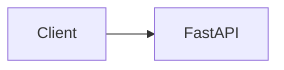

# Diagrams

Mermaid source files for ECI Platform.

## Available Diagrams

| File | Represents |
|---|---|
| [`architecture.mmd`](architecture.mmd) | The implemented layered system: client → FastAPI API → application service → `AIProvider` → `MockAIProvider` / `MicrosoftFoundryProvider` / `AmazonBedrockProvider`, with the shared `providers/common` contract used by the two real LLM adapters |
| [`request-flow.mmd`](request-flow.mmd) | Sequence diagram of a communication-analysis request: validation, service resolution, provider analysis, result return, and the safe error-response path |
| [`provider-abstraction.mmd`](provider-abstraction.mmd) | The `AIProvider` interface, `MockAIProvider`, `MicrosoftFoundryProvider`, `AmazonBedrockProvider`, and the configuration-driven factory |
| [`deployment-azure.mmd`](deployment-azure.mmd) | Azure Container Apps path: same image → ACR → Container Apps → user-assigned Managed Identity → Microsoft Foundry |
| [`deployment-aws.mmd`](deployment-aws.mmd) | ECS Fargate path: same image → ECR → Fargate → ECS container credential provider → Task Role → Amazon Bedrock |
| [`observability-application.mmd`](observability-application.mmd) | Common application telemetry: HTTP → request_id middleware → API → service → provider → structlog JSON → stdout |
| [`observability-azure.mmd`](observability-azure.mmd) | Azure observability: stdout JSON → Container Apps → Log Analytics, plus native Azure Monitor metrics (min 0 / max 1) |
| [`observability-aws.mmd`](observability-aws.mmd) | AWS observability: stdout JSON → awslogs → CloudWatch Logs, plus standard AWS/ECS CPU and memory (desiredCount 0 when idle) |

## Implemented vs. Placeholder

`architecture.mmd`, `request-flow.mmd`, and `provider-abstraction.mmd` describe the application as it exists today.

`deployment-azure.mmd` and `deployment-aws.mmd` describe the Phase 6C hosting paths. Direct Fargate public-IP ingress is verification-only. See [`docs/cloud/deployment.md`](../cloud/deployment.md).

`observability-application.mmd`, `observability-azure.mmd`, and `observability-aws.mmd` describe the Phase 7 telemetry paths. See [`docs/cloud/observability.md`](../cloud/observability.md).

## Embedding Mermaid in Markdown

GitHub, and most modern Markdown renderers, render Mermaid automatically inside a fenced code block tagged `mermaid`:



To embed one of the `.mmd` files in a document, copy its contents into a ```` ```mermaid ```` fenced block (Markdown does not support directly transcluding an external file). See [Sequence Diagrams](../architecture/sequence-diagrams.md) for worked examples using this pattern.
