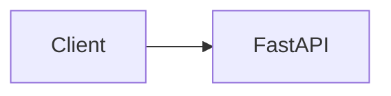

# Diagrams

Mermaid source files for ECI Platform.

## Available Diagrams

| File | Represents |
|---|---|
| [`architecture.mmd`](architecture.mmd) | The implemented layered system: client → FastAPI API → application service → `AIProvider` → `MockAIProvider` / `MicrosoftFoundryProvider` / `AmazonBedrockProvider`, with the shared `providers/common` contract used by the two real LLM adapters |
| [`request-flow.mmd`](request-flow.mmd) | Sequence diagram of a communication-analysis request: validation, service resolution, provider analysis, result return, and the safe error-response path |
| [`provider-abstraction.mmd`](provider-abstraction.mmd) | The `AIProvider` interface, `MockAIProvider`, `MicrosoftFoundryProvider`, `AmazonBedrockProvider`, and the configuration-driven factory |
| [`deployment-azure.mmd`](deployment-azure.mmd) | **Placeholder.** Future Azure deployment topology — not yet designed |
| [`deployment-aws.mmd`](deployment-aws.mmd) | **Placeholder.** Future AWS deployment topology — not yet designed |

## Implemented vs. Placeholder

`architecture.mmd`, `request-flow.mmd`, and `provider-abstraction.mmd` describe the system as it exists today (Phase 6B). Amazon Bedrock is implemented, covered by offline tests, and live-verified through ECI.

`deployment-azure.mmd` and `deployment-aws.mmd` remain empty placeholders. No cloud hosting architecture has been implemented yet — see [`docs/cloud/`](../cloud/README.md) and [`docs/roadmap/phase-06-cloud-deployment.md`](../roadmap/phase-06-cloud-deployment.md).

## Embedding Mermaid in Markdown

GitHub, and most modern Markdown renderers, render Mermaid automatically inside a fenced code block tagged `mermaid`:



To embed one of the `.mmd` files in a document, copy its contents into a ```` ```mermaid ```` fenced block (Markdown does not support directly transcluding an external file). See [Sequence Diagrams](../architecture/sequence-diagrams.md) for worked examples using this pattern.
