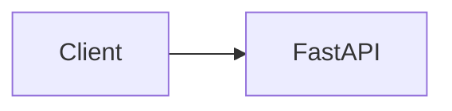

# Diagrams

Mermaid source files for ECI Platform.

## Available Diagrams

| File | Represents |
|---|---|
| [`architecture.mmd`](architecture.mmd) | Layered system: HTTP analyze path, connector ingestion, Phase 14 mailbox list/analyze sequences in [`sequence-diagrams.md`](../architecture/sequence-diagrams.md), and Phase 13 mailbox OAuth / credential-store edges. Phase 11/12 execute sequences remain in [`sequence-diagrams.md`](../architecture/sequence-diagrams.md). |
| [`mailbox-oauth.mmd`](mailbox-oauth.mmd) | Phase 13 mailbox delegated OAuth: authorize/reauthorize/disconnect, credential stores, PostgreSQL advisory coordination, runtime refresh |
| [`request-flow.mmd`](request-flow.mmd) | Sequence diagram of analyze: validation, identity TX, AI inference, history save, and failure paths including 503-before-AI |
| [`provider-abstraction.mmd`](provider-abstraction.mmd) | The `AIProvider` interface, `MockAIProvider`, `MicrosoftFoundryProvider`, `AmazonBedrockProvider`, and the configuration-driven factory |
| [`deployment-azure.mmd`](deployment-azure.mmd) | Azure Container Apps path: same image → ACR → Container Apps → user-assigned Managed Identity → Microsoft Foundry |
| [`deployment-aws.mmd`](deployment-aws.mmd) | ECS Fargate path: same image → ECR → Fargate → ECS container credential provider → Task Role → Amazon Bedrock |
| [`observability-application.mmd`](observability-application.mmd) | Common application telemetry: HTTP → request_id middleware → API → service → provider → structlog JSON → stdout |
| [`observability-azure.mmd`](observability-azure.mmd) | Azure observability: stdout JSON → Container Apps → Log Analytics, plus native Azure Monitor metrics (min 0 / max 1) |
| [`observability-aws.mmd`](observability-aws.mmd) | AWS observability: stdout JSON → awslogs → CloudWatch Logs, plus standard AWS/ECS CPU and memory (desiredCount 0 when idle) |
| [`identity.mmd`](identity.mmd) | Identity classes: Client → Entra → JWT → ECI; mailbox delegated OAuth; ECI → Foundry UAMI / Bedrock task role / Key Vault / Secrets Manager; GitHub → OIDC deploy identities; PostgreSQL identity future/not provisioned |
| [`cicd.mmd`](cicd.mmd) | GitHub Actions quality plus PostgreSQL integration; CD build-once → ACR → Azure Container Apps and ECR → ECS |
| [`ingress.mmd`](ingress.mmd) | Azure HTTPS → Container Apps → ECI; AWS current operator `/32` HTTP (verification-only); AWS ALB HTTPS verified then torn down |
| [`persistence.mmd`](persistence.mmd) | OIDC principal → IdentityResolver → users/external_identities → analysis workflow → AI provider and PostgreSQL history |
| [`persistence-cloud.mmd`](persistence-cloud.mmd) | Same ECI application; future Azure-local and AWS-local PostgreSQL not provisioned in Phase 9; CI ephemeral `postgres:16` proof |

## Implemented vs. Placeholder

`architecture.mmd`, `request-flow.mmd`, `mailbox-oauth.mmd`, and `provider-abstraction.mmd` describe the analyze, connector, and mailbox-OAuth paths as they exist today. `architecture.mmd` includes the Phase 10 connector path and Phase 13 credential-store edges. Bounded mailbox listing and selected-message analyze HTTP sequences live in [`sequence-diagrams.md`](../architecture/sequence-diagrams.md). It does not depict every workflow execute branch. Phase 11 and Phase 12 sequences live in [`sequence-diagrams.md`](../architecture/sequence-diagrams.md). Production mailbox OAuth is implemented; PostgreSQL does not store OAuth tokens. Background workers and automatic replies are not depicted because they are not implemented.

`deployment-azure.mmd` and `deployment-aws.mmd` describe the Phase 6C hosting paths. Direct Fargate public-IP ingress is verification-only. See [`docs/cloud/deployment.md`](../cloud/deployment.md).

`observability-application.mmd`, `observability-azure.mmd`, and `observability-aws.mmd` describe the Phase 7 telemetry paths. See [`docs/cloud/observability.md`](../cloud/observability.md).

`identity.mmd`, `cicd.mmd`, and `ingress.mmd` describe Phase 8 identity, CI/CD, and ingress. Azure HTTPS and GitHub OIDC CD are live. AWS ALB HTTPS is verified-not-retained. AWS real-bearer traffic remains deferred until domain/ACM TLS. See [`docs/cloud/authentication.md`](../cloud/authentication.md) and [`docs/cloud/deployment.md`](../cloud/deployment.md).

`persistence.mmd` and `persistence-cloud.mmd` describe Phase 9 persistence. The application is PostgreSQL-compatible. Managed Azure/AWS databases are not provisioned. See [`docs/architecture/persistence.md`](../architecture/persistence.md) and [`docs/cloud/persistence.md`](../cloud/persistence.md).

## Embedding Mermaid in Markdown

GitHub, and most modern Markdown renderers, render Mermaid automatically inside a fenced code block tagged `mermaid`:



To embed one of the `.mmd` files in a document, copy its contents into a ```` ```mermaid ```` fenced block (Markdown does not support directly transcluding an external file). See [Sequence Diagrams](../architecture/sequence-diagrams.md) for worked examples using this pattern.
